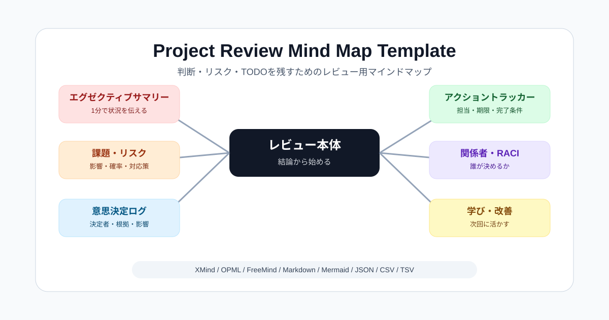

# Project Review Mind Map Template

プロジェクトレビューを「話して終わり」にしないための、実務向けマインドマップテンプレートです。

会議中に、結論、リスク、意思決定、TODO、担当、期限、完了条件まで残せるように設計しています。
XMindを主形式にしつつ、XMindを持っていない人にも共有できるように主要な交換フォーマットを同梱しています。



## 何ができるか

- プロジェクトレビューの論点を1枚のマインドマップに整理できる
- 意思決定、リスク、TODOを別シートで追跡できる
- XMindなしでもMarkdown、OPML、CSVなどで内容を確認できる
- 他のマインドマップツールやアウトライナーへ持ち出しやすい
- CIでテンプレートと生成済みエクスポートのズレを検知できる

## 何が嬉しいか

- レビュー会議が進捗報告だけで終わりにくくなる
- 「誰が、いつまでに、何を終わらせるか」が残る
- リスクと意思決定が会議後に埋もれにくい
- XMind利用者と非利用者が同じ構造を共有できる
- 将来ツールを変えても `.xmind` だけに閉じ込められない

## 5分で試す

1. [`templates/project-review-public-template.xmind`](templates/project-review-public-template.xmind) をXMindで開く
2. プロジェクト用に複製する
3. `00 使い方` を読む
4. `01 レビュー本体` の `00 エグゼクティブサマリー` から埋める
5. 会議で決まったことを `02 意思決定ログ`、`03 リスク台帳`、`04 アクショントラッカー` に残す

XMindがない場合は、まず [`exports/project-review-public-template.md`](exports/project-review-public-template.md) を見てください。

## サンプル

- 記入済みサンプル: [`examples/sample-project-review.md`](examples/sample-project-review.md)
- レビュー観点: [`REVIEW.md`](REVIEW.md)
- 互換性調査: [`docs/format-compatibility-research.md`](docs/format-compatibility-research.md)

## 配布フォーマット

| 形式 | 用途 |
| --- | --- |
| `.xmind` | XMindで編集する一次成果物 |
| `.opml` | アウトライナーや一部マインドマップツールへの移行 |
| `.mm` | FreeMind / Freeplane互換 |
| `.md` | GitHub、Notion、Docsなどで読む軽量版 |
| `.mmd` | Mermaid mindmapとしてドキュメント埋め込み |
| `.json` | 自動処理、変換、アプリ連携 |
| `.csv` / `.tsv` | 表計算、台帳化、レビュー項目の棚卸し |

生成済みファイルは [`exports/`](exports/) にあります。

PDF、PNG、SVGなどの見た目固定ファイルは、XMindなどGUIレンダラー依存のためCIでは自動生成していません。必要な場合はXMindで `.xmind` を開いてエクスポートしてください。

Mermaid mindmapは実験的な仕様を含むため、`.mmd` はbest effortの交換形式です。厳密な見た目確認は利用先のMermaidレンダラーで行ってください。

## テンプレート内容

- エグゼクティブサマリー
- 前提・ゴール・スコープ
- 進捗・マイルストーン
- 成果物・品質
- 課題・リスク
- 意思決定ログ
- アクショントラッカー
- 関係者・RACI
- 学び・改善

## ファイル構成

- `templates/`: XMindテンプレート
- `exports/`: 交換フォーマット
- `examples/`: 記入済みサンプル
- `docs/`: 利用メモ、互換性調査
- `tools/`: 生成・変換スクリプト
- `scripts/`: ローカル検証・CI検証スクリプト

## ローカル検証

公開前に以下を実行します。

```powershell
./scripts/test-local.ps1
```

このチェックでは、チェックイン済みXMind、再生成したXMind、交換フォーマット、Markdownリンク、ローカル絶対パス混入を検証します。

## 再生成

XMindテンプレートを再生成する場合:

```powershell
./tools/make-project-review-public-template.ps1
```

交換フォーマットを再生成する場合:

```powershell
./tools/export-template-formats.ps1
```

## ライセンス

MIT Licenseです。詳しくは [`LICENSE`](LICENSE) を参照してください。
